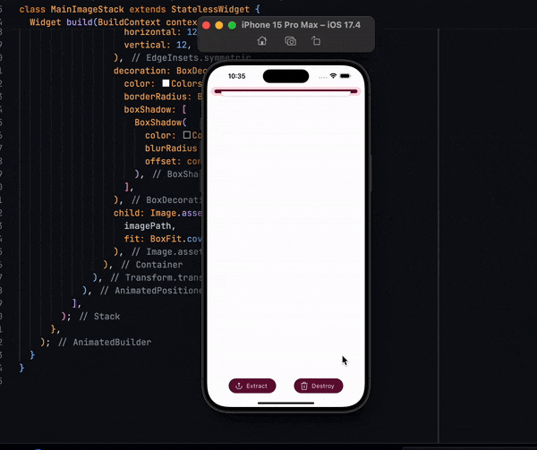
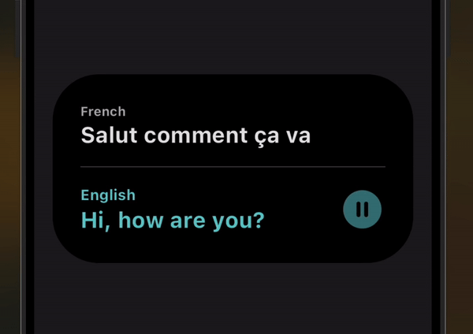
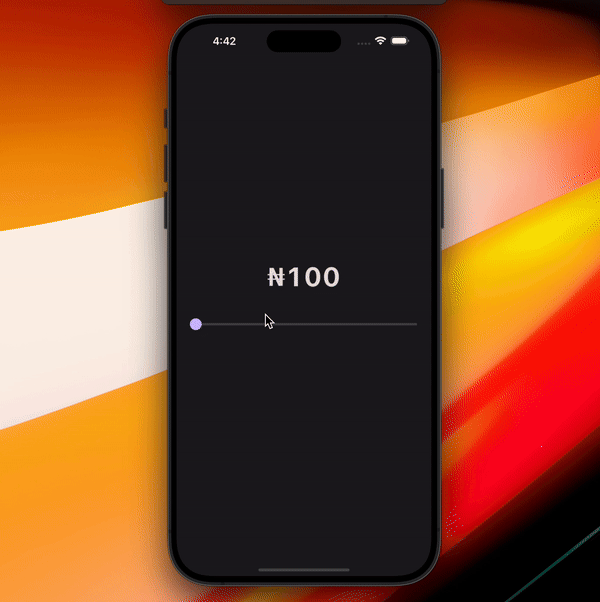
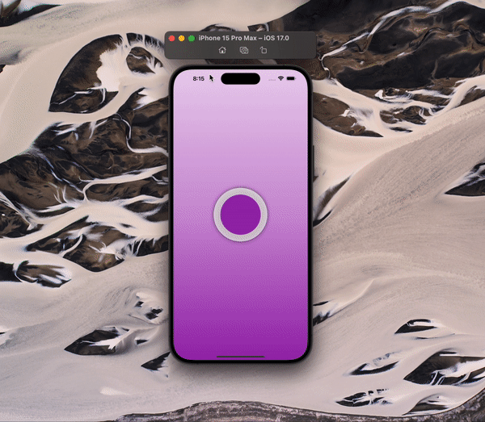
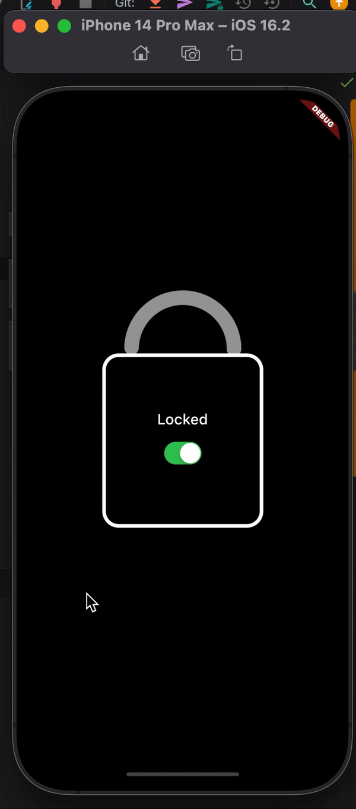
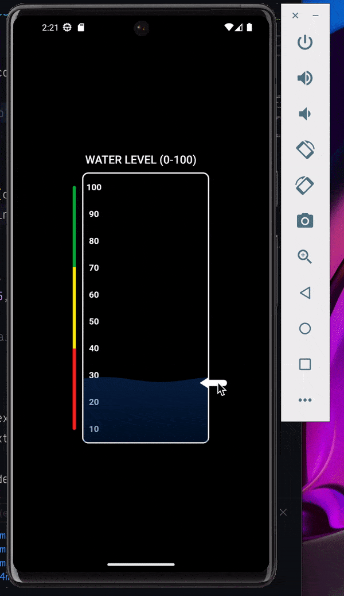

# 🔐 Flutter Advance 

 [Twitter Profile](https://twitter.com/zakipamir)

Feel free to star, fork and contribute.

### Photo Extractor || [Link to code](https://github.com/Flutter-Template/flutter_advance/blob/main/lib/photo_extractor/view/photo_extractor_page.dart)

### Text Shimmer Wave || [Link to code](https://github.com/Flutter-Template/flutter_advance/blob/main/lib/text_shimmer_wave.dart)

### Animated Slider || [Link to code](https://github.com/Flutter-Template/flutter_advance/blob/main/lib/animated_slider/view/animated_slider_page.dart) || [Youtube Tutorial](https://youtu.be/H8tUY9F0mwE)

### Swipe to pay || [Link to code](https://github.com/Flutter-Template/flutter_advance/blob/main/lib/swipe_to_pay/view/swipe_to_pay_page.dart) || [Youtube Tutorial](https://youtu.be/H8tUY9F0mwE)

### Blur Animation || [Link to code](https://github.com/Flutter-Template/flutter_advance/blob/main/lib/blur_animation.dart)

### Petal Menu Animation || [Link to code](https://github.com/Flutter-Template/flutter_advance/blob/main/lib/petal_menu.dart)

### Rainbow Sticks Animation || [Link to code](https://github.com/Flutter-Template/flutter_advance/blob/main/lib/rainbow_sticks_page.dart) || [Youtube Tutorial](https://youtu.be/6lkAo-_-IME)

### Telegram Theme Switcher || [Link to code](https://github.com/Flutter-Template/telegram_theme_switcher_animation)

### Animated Lock || [Link to code](https://github.com/Flutter-Template/flutter_advance/blob/main/lib/animated_lock.dart)

### Animated Progress Bar || [Link to code](https://github.com/Flutter-Template/flutter_advance/blob/main/lib/animated_progress_bar.dart)

### Animated Card || [Link to code](https://github.com/Flutter-Template/flutter_advance/blob/main/lib/animated_card.dart)

### Phone Pattern || [Link to code](https://github.com/Flutter-Template/flutter_advance/blob/main/lib/phone_pattern.dart)

### Water Wave Animation || [Link to code](https://github.com/Flutter-Template/flutter_advance/blob/main/lib/water_wave_animation/water_wave_animation_page.dart)

##  Developer

